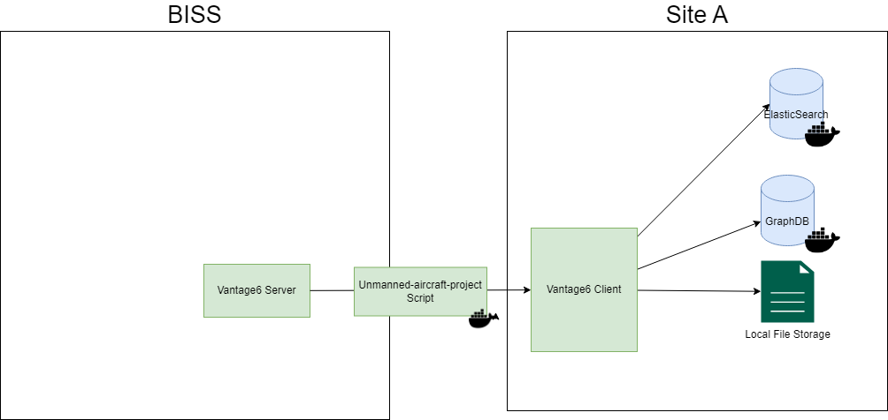

---
# unmanned_aircraft_project

This is an example project to show the start of a script that could potentially be integrated into a Vantage6 Wrapper. See the Assignment header below for further details on a possible design.

## Install it from PyPI

```bash
pip install .
```

## Usage

```bash
$ python -m unmanned_aircraft_project
```

## Development

Read the [CONTRIBUTING.md](CONTRIBUTING.md) file.

## Assignment

### Assumptions

The solution implemented depends on a number of factors such as:
- The site at which the document is stored. For example, many privacy minded entities like hospitals can be notoriously difficult when it comes to installing outside aplications or opening up ports.
- The likelihood of repeat requests, potential for reuse and the need for scalability. If the example provided is a one-off, then doing some manual labour and light scripting is feasible. The more likely it is the task will be repeated in the future, the more it makes sense to invest time in a more robust solution. If there is likely reuse within the same domain for example, an application could be made that takes into account the most popular ontologies and the recurring structure of the legal documents. If there are numerous similar requests accross domains, it may become viable to invest time to create a general purpose solution, with configurable ontologies and intelligent ways of allowing (automated and/or manual) concept mappings from local definitions to more FAIR concepts. The same reasoning holds for the federated learning aspect of the question as well. Although here in almost all cases it will probably be most convenient to reuse an existing solution such as [Vantage6](https://docs.vantage6.ai/en/main/) (I've implemented a similar platform in the past meant as an all-purpose federated learning infrastructure for the Personal Health Train).
- The type of eventual algorithms that will make use of the data, and whether or not we know beforehand what they will be. If the data is to be used for one specific use-case, we can tailor the output format to best suit the needs of the algorithm. For example, storing data in ElasticSearch will be very helpful for search related tasks, relational data will be the most robust solution for consistent variables with predictable values, Triple stores / Graph solutions will allow for the best FAIRification, a text annotation solution would be beneficial in the case of NLP data annotation and so on. 

For simplicity and time sake, I will assume the following:
- We will want to do similar tasks in the future for the same site, both within the same domain and in other domains.
- We have need for a general purpose fairification solution at the site where the data is stored
- The site at which the software is installed is very cooperative, and has the capabilities to install software and open up ports.
- The data will be used now mainly for NLP tasks, but needs to be FAIRified further for unknown future use-cases and/or requirements specified in the proposal.

### Architecture



- Vantage6 will be used as the federated learning platform to ensure no privacy sensitive data leaves the site. In this case we don't need any of the complex functionality of doing multiple iterations and waiting until a model converges - it suffices to do one run. We can reuse one of the existing wrappers, and implement a minimal central function, and a federated function that runs the data conversion algorithm. This federated function contains the actual algorithm and uses the environment variables specified at the site to retrieve the document (either using an HTTP GET or retrieving it from file storage), as well as the location of the GraphDB REST API and where to store CSVs. 
- The algorithm itself is implemented in Python.  and uses and uses the Ontotext platform to do the actual annotation. It takes as input the document, and outputs a CSV file with the annotations.
- GraphDB is used to store semantic concepts It also extracts concepts, creates relationships and stores this data in GraphDB so that we have a semantic graph of the document - a great starting point for FAIRification of our data.
- As a bonus, we store document data in ElasticSearch. Perhaps in the future we will want to use this data for search related tasks, or people at the site will want to use it for local search purposes.
- All services above can be provided to the site in one easy to use docker-compose file with minimal configuration.
- It may be possible to use OntoText Platform to avoid some of the scripting tasks above and do the entire process through their platform. However I've not been provided a trial license at time of writing and it is poorly documented on their own website (perhaps this requires consultancy on their part).

### Ontologies
We identify a number of candidate ontologies that are relevant for the domain of the document. This will allow for more specific annotations and a higher level of 'FAIRness'. Reusing existing ones where possible is always preferable to creating ontologies from scratch.
- The http://www.dronetology.net/dronetology/index-en.html dronetology ontology seems highly relevant to some of the concepts mentioned in the text. 
- The https://op.europa.eu/en/web/eu-vocabularies/eli ontology was created specifically for the annotation of European legislation metadata. It should be highly relevant, though I've not taken the time to compare concepts due to time constraints.

### Additional tasks
- Implement FAIRification by converting named entities to triples using the ontologies above. It may be useful to look into existing solutions such as [this one](https://permid.org/rdfResults)
- Implement storage of triples in GraphDB
- Implement storage of document data in ElasticSearch
- Add example code to an actual Vantage6 wrapper
- Expand on very basic NLP example-like code

### Additional FAIRification tasks
- We publish existence of the data in a registry (even though the data itself is not available) with a global identifier such as a DOI so that it persists regardless of what happens in the company or project.
- Short instructions are provided on how to request access the data if applicable, and how to query the output using vantage6 (perhaps using the sparql wrapper) 
- The algorithm is packaged as a dockerfile, and does not contain any site specific information. We can therefore publish the image to DockerHub with usage instructions on GitHub to make the algorithm itself Finable, Accessible, Interoperable and Reuseable.
- Source code for the algorithm is provided on GitHub, with a license and a readme file that explains how to use it.
- Licensing information is added to the registry for the data
- Provenance information is added through the script using some configurable variables.
